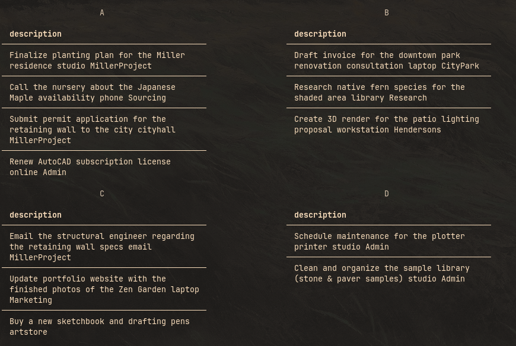
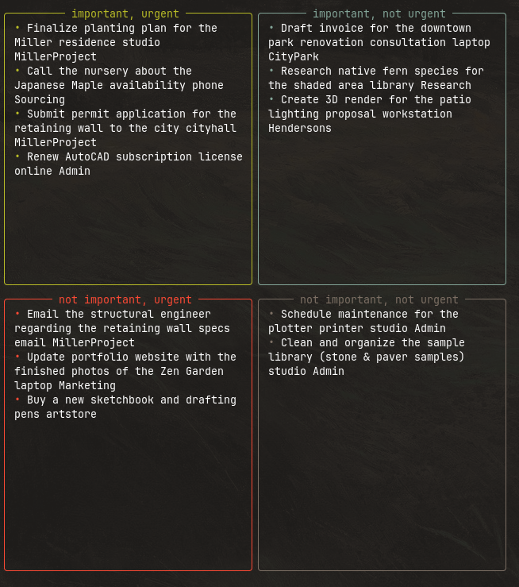

<p align="center">
    <strong>✔️ vitodo</strong>
</p>

<p align="center">
  vitodo is a highly customizable
  <a href="https://github.com/todotxt/todo.txt">todo.txt</a>
  visualization tool
</p>

<p align="center">
  <a href="https://pypi.org/project/vitodo/">
    
  </a>
  <a href="https://pypi.org/project/vitodo/">
    
  </a>
  <a href="https://pypi.org/project/vitodo/">
    
  </a>
</p>

<p align="center">
  <strong><a href="https://github.com/dybdeskarphet/vitodo/wiki">Wiki</a></strong>
  &bull;
  <strong><a href="./CHANGELOG.md">Changelog</a></strong>
</p>

## Overview

- `grouped-view` – shows to-do list grouped with the specified key
- `eisenhower-view` – shows to-do list in an Eisenhower matrix

<details>
  <summary>Previews</summary>
  
    
</details>

## Installation

Install with `pipx`, `pip` or `uv` accordingly:

```
pipx install vitodo
pip install vitodo
uv tool install vitodo
```
