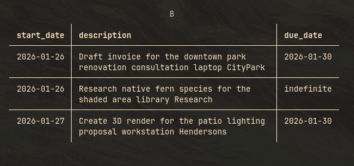

# `[grouped_view]` Configuration

## `group_by`

> Default: `priority`

Determines the primary key used to categorize your tasks. We restrict this to high-level categories. Grouping by unique fields like descriptions or timestamps would result in a chaotic, unreadable table.

**Accepted values:** `priority`, `context`, `project`.

### Example Input

Given the following `todo.txt` file:

```todotxt
(A) 2026-01-27 Call the nursery about the Japanese Maple availability @phone +Sourcing
(A) 2026-01-27 Finalize planting plan for the Miller residence @studio +MillerProject due:2026-01-29
(A) 2026-01-27 Renew AutoCAD subscription license @online +Admin due:2026-01-28
(A) 2026-01-27 Submit permit application for the retaining wall to the city @cityhall +MillerProject due:2026-02-01
(B) 2026-01-26 Draft invoice for the downtown park renovation consultation @laptop +CityPark due:2026-01-30
(B) 2026-01-26 Research native fern species for the shaded area @library +Research
(B) 2026-01-27 Create 3D render for the patio lighting proposal @workstation +Hendersons due:2026-01-30
(C) 2026-01-25 Buy a new sketchbook and drafting pens @artstore
(C) 2026-01-25 Email the structural engineer regarding the retaining wall specs @email +MillerProject
(C) 2026-01-26 Update portfolio website with the finished photos of the Zen Garden @laptop +Marketing
(D) 2026-01-21 Clean and organize the sample library (stone & paver samples) @studio +Admin
(D) 2026-01-22 Schedule maintenance for the plotter printer @studio +Admin
```

### Example Output

Here is how that data looks when grouped by `priority`:


## `columns`

> Default: `["description"]`

Defines which data points are displayed within the group tables.

**Available columns:** `priority`, `start_date`, `description`, `project`, `context`, `due_date`

### Example

Using the same `todo.txt` above, focusing on the **(B)** group with the configuration `["start_date", "description", "due_date"]`:



### Column Styling

If you want to spice up the look, you can pass an object instead of a string. This allows for specific coloring and font weights.

```toml
{ column = "description", color = "#ff0000", bold = true, italic = false }
```

## `box_type`

> Default: `"MINIMAL"`

Selects the border style for the tables. Whether you want a retro ASCII vibe or modern rounded corners, we got you.

**Supported Styles:**

| Style Category | Options                                                                         |
| -------------- | ------------------------------------------------------------------------------- |
| **Standard**   | `ASCII`, `ASCII2`, `SQUARE`                                                     |
| **Minimal**    | `MINIMAL`, `MINIMAL_HEAVY_HEAD`, `SIMPLE`, `SIMPLE_HEAD`, `SIMPLE_HEAVY`        |
| **Heavy/Bold** | `HEAVY`, `HEAVY_EDGE`, `HEAVY_HEAD`, `DOUBLE`, `DOUBLE_EDGE`                    |
| **Other**      | `ASCII_DOUBLE_HEAD`, `SQUARE_DOUBLE_HEAD`, `HORIZONTALS`, `ROUNDED`, `MARKDOWN` |

## `max_column_width`

> Default: `40`

Sets the maximum character width for tables. Useful for keeping long descriptions from breaking your terminal layout.

## `line_separator`

> Default: `true`

Toggles the horizontal divider lines between rows.

- `true`: clearer separation between tasks.
- `false`: a tighter, cleaner look.

## `title`

Configures the styling of the group headers (e.g., the `A` or `context` header).

```toml
{ color = "blue", bold = true, italic = false }
```
